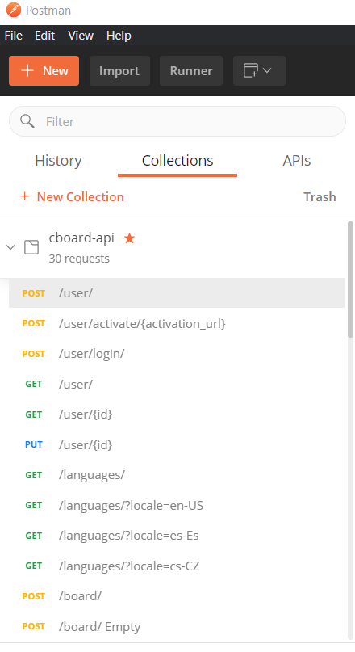

# Cboard API - REST API for Cboard application

[](https://app.circleci.com/pipelines/github/cboard-org/cboard-api)

[Cboard](https://app.cboard.io/) is an augmentative and alternative communication (AAC) web application, allowing users with speech and language impairments (autism, cerebral palsy) to communicate by symbols and text-to-speech. This repo supports the Cboard front-end, providing backend functionality and persistence.

Learn more about the [Cboard project](https://github.com/cboard-org/cboard).

## Pre-requisites
Before installing and running the Cboard API, be sure you have **locally** installed the following tools:
* Node.js > 12.0.0 (download [here](https://nodejs.org/en/download/))
* MongoDB > 4.0.0 (download [here](https://docs.mongodb.com/manual/installation/))


Use the following commands to check that you have them successfully installed, and/or to double-check your versions:
* `node -v`
* `mongo --version`

## Install
Clone the repository and install npm dependencies:
```bash
$ git clone https://github.com/cboard-org/cboard-api.git
$ cd cboard-api
$ npm install
```
## Start the database

Start MongoDB. ([See MongoDB docs, if needed](https://docs.mongodb.com/manual/tutorial/manage-mongodb-processes/)).

```bash
$ mongod
```

## Configure environment variables

The Cboard API is a cloud service, and it needs access to several cloud services as well, like user authentication, email sending, etc. This is all configured using environment variables on the platform the API is running. Following are the mandatory variables to be defined:

* AZURE_STORAGE_CONNECTION_STRING
* FACEBOOK_APP_ID
* FACEBOOK_APP_SECRET
* FACEBOOK_CALLBACK_URL
* GCLOUD_PROJECT
* GOOGLE_APP_ID
* GOOGLE_APP_SECRET
* GOOGLE_APPLICATION_CREDENTIALS
* GOOGLE_CALLBACK_URL
* JWT_SECRET
* MONGO_URL
* REACT_APP_DEV_API_URL
* SENDGRID_API_KEY

## Run the API Server

In a separate terminal tab/window, run the project server.

```bash
$ npm run dev 
```
For automatically restarting the server when file changes in the directory are detected

or 

```bash
$ npm run start
```
Both of them start a server process listening on port 10010. You will now be able to make calls to the API.

(If you are having trouble, make sure you have successfully installed the pre-requisites -- see "Pre-requisites" section above.)

## See API Paths

Swagger provides an interactive, browser-based editor. To visualize available API endpoints:

```bash
$ localhost:10010/docs/
```
That show API swagger editor (as shown below):


## Mailing system configuration
When a new user is created using the API, some verification emails are generated. To use a specific SMPT server, locally edit the following file to use values for an SMTP server you own:
**config/env/development.js**
And look for following config block:
```javascript
    emailTransport: {
        from: 'cboard@cboard.io',
        host: 'smtp.sendgrid.net',
        port: 465,
        secure: true,
        service: 'Sendgrid',
        auth: {
            user: 'apikey',
            pass: process.env.SENDGRID_API_KEY
        }
    }
```

## Testing 
There are two types of tests in the repository, that can help you with the development and the debugging of the api service: 

* Postman tests 
* Mocha tests

### Postman tests 
Postman is a scalable API testing tool, and we mainly use it for debugging and testing during the development process. These tests are loocated under the following folder: 
```
cboard-api/test/postman
```

There, you can find a **postman collection file**. This file can be imported as a new collection into Postman and you will see a list of requests and tests that you can use to exercise the cboard API.
Note: you will need a deployed and well configured cboard-api instance running on your server to execute the tests against to. 



### Mocha Tests
Mocha is a javascript framework for Node.js which allows Asynchronous testing. We have developed a few Mocha test suites that are running everytime a new Pull Request is created / updated. 
The goal of these tests is to verify that all of the api calls are functional and you are not introducing regression bugs into the code base. 
The command to run the Mocha tests is simply: 

```
npm test 
```

## License

Code - [GPLv3](https://github.com/shayc/cboard/blob/master/LICENSE)  
Symbols - [CC BY-SA](https://creativecommons.org/licenses/by-sa/2.0/uk/)
